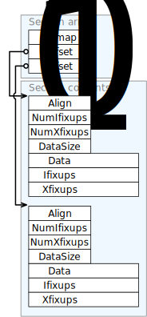

# pstore structures

## File Structures

### Header
Field    | Size (bytes) | Description
-------- | ------------ | -----------
signature1 | 4 |  The file signature is split into two pieces of four bytes each. The first of these (signature1) is an array of bytes so that the signature is easily recongisable in a hex dump, the second is a 32-bit value so that we can easily verify the machine endianness (a BOM in effect).
signature2 | 4 | The second half of the file signature. This value is used to determine the endian-ness of the file. |
version | 2 | 
header_size | 4 |
uuid | 16 | 
crc | 4 | The fields of the header, up to and including this one, are not modified as the code interacts with the data store; they're effectively read-only. This crc is used to ensure that the fields from #signature1 to #sync_name are not modified.
unused2 | 8 | Always zero.
footer_pos | 8 | The file offset of most recent file footer. This calue is modifies as the very last step of commiting a transaction.

### Transaction Footer

Field | Size (bytes) | Description
----- | ------------ | -----------
signature1 | 8 | 
generation | 4 |
unused1 | 4 | Unused. Always 0.
size | 8 | The number of bytes contained by this transaction. The value does not include the size of the footer record.
time | 8 | The time at which the transaction was committed, in milliseconds since the epoch.
prev_generation | 8 | A pointer to the previous generation. This field forms a reverse linked list which allows a consumer to enumerate the generations contained within the store and to "sync" to a specific generation number.
index_records_array index_records; | | 
unused2 | 4 | Unused. Always 0.
unused3 | 4 | Unused. Always 0.
crc | 4 | A simple crc32 of the transaction footer preceeding this one (i.e. from the start of the `signature1` field through to the end of `unused3` field. The fields of a transaction footer are not modified as the code interacts with the data store: the memory that is occupies as marked as read-only as soon as the host OS and hardware permits. Despite this guarantee it's useful to be able to ensure that the reverse-order linked list of transactions -- whose head is given by header::footer_pos is intact and that we don't have a stray pointer.
unused4 | 4 | Unused. Always 0.
signature2 | 8 | 

## Index Structures
### Leaf node
### Internal node

Field | Size (bytes) | Description
----- | ------------ | -----------
signature | 8 | A magic number. Acts as a quick integrity test for the index structures.
bitmap | 8 | For each index in the children array, the corresponding bit is set in this field if it is a reference to an internal, linear, or leaf node.
children | n*8 | The array of child node references. Each entry is an 8-byte pstore address, the number of entries is given by the population count of the`bitmap` field.

### Linear node

Field | Size (bytes) | Description
----- | ------------ | -----------
signature | 8 | A magic number. Acts as a quick integrity test for the index structures.
size | 8 | The number of members of the `leaves` array.
leaves | n | Each entry is an 8 byte pstore address, the number of entries is given by the `size` field.

### Strings

## Program Repository Structures
## Fragments

Fragments are stored as a compressed sparse array of offsets where each offset is a reference to the corresponding section's contents. The sparse array uses the same scheme as described in "Fast and Space Effcient Trie Searches", Bagwell [2000]. In brief, each bit of a 64-bit integer represents the presense of absence of the corresponding array index; the population count of the value enables the absolute index of any available element to be easily calculated. 

### Section array
The section array header is a variable-length structure which consists of a sparse array of offsets for the section data. The offsets are a positive number of bytes from the start of the section array structure. The number of elements in the array is equal to the population counts of the `bitmap` field. 
relative to to the single fixed-size integer value which describes the number and interpretation of each of a array of fields w

Field    | Size (bytes) | Description
-------- | ------------ | -----------
bitmap   | 8 | The population count of this field gives the number of members in the `offset` array. Array indices that are present have a 1 in the corresponding bit position.
offsetn | 8 | 

### Sections
Each "section" within a fragment is given a constant index in this array. This obviously imposes a hard limit on the maximum number of sections within a fragment.

A section itself consists of three variable-length arrays:

- The data array. An array of bytes making up the section payload. For example, in a "text" section these would be an individual function's instructions.
- The internal fixup ("Ifixup") array.
- The external fixup ("Xfixup") array.

The number of entries in each of these arrays is given by the DataSize, NumIFixups, and NumXfixups members of the section header.

Field    | Size (bytes) | Description
-------- | ------------ | -----------
Align      | 1 | The alignment of this section, expressed as a power of 2.
NumIFixups | 3 | The number of internal fixup records contained within this section.
NumXFixups | 4 | The number of external fixup records contained within this section.
DataSize   | 8 | The number of bytes of payload data containing within this section.

### Internal Fixups
Internal fixups are those fixups which refer to other sections within the same fragment. Because the target fragment is known, these fixups improve performance by avoiding searches of the fragment index.

Field    | Size (bytes) | Description
-------- | ------------ | -----------
| | 

### External Fixups
External fixups are used to refer (by name) to other fragments within the program. They form the arcs in the program graph of which fragments are the vertices.

Field    | Size (bytes) | Description
-------- | ------------ | -----------
| | 

## Ticket

References
---
Bagwell, P. 2000. Fast and space efficient trie searches. Technical Report, EPFL Swtzerland.
